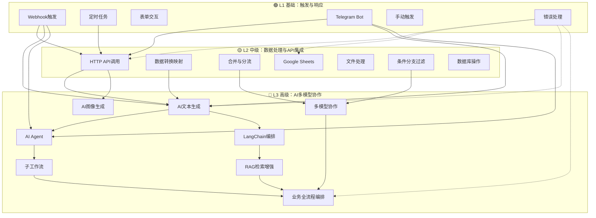

# AIGC n8n 工作流技能体系 — 渐进式构建指南

> 基于 AIGC_Files 中 ~107 个生产级 n8n 工作流 + Workflow/ 中 29+ 个新增工作流提炼的 21 个模块化技能单元
>
> 从零开始，逐步构建你的第一个 AIGC 工作流，直到多模型协作业务全流程

---

## 🆕 最近更新 (2026-06-14)

从 `Workflow/` 目录吸收了新一代工作流模式：

| 新增模式 | 关联技能 | 参考工作流 |
|----------|----------|-----------|
| RunningHub 异步视频生成管道 | L3-02, L3-08 | `WorkflowDemo01/` (6个工作流, 42节点主控) |
| Mimo/MiniMax TTS 音频合成 | L2-01 | `current_state.json`, `workflow.json` |
| 播客生成管道 (搜索→脚本→TTS→合并) | L3-08 | `workflow.json` (25节点) |
| Model Selector 平台路由 | L3-06 | `xiaolin/AIAgentTool工作流.json` |
| Google File Search RAG + MCP | L3-05 | `xiaolin/Google RAG Workflow with MCP.json` |
| Excel 数据自动清洗 | L2-02, L2-04 | `xiaolin/ExcelAutoCleaning.json` |
| 海报生成器 (11种风格) | L1-03, L3-02 | `xiaolin/n8nposter.json` |
| 7平台 RSS 监控雷达 | L2-03 | `xiaolin/多平台数据监控(雷达)工作流.json` |

---

## 技能全景图



---

## 三级技能索引

### 🟢 L1 基础层 — 先学会"启动"

| 编号 | 技能 | 文件 | 核心节点 | 节点数参考 |
|------|------|------|----------|-----------|
| L1-01 | Webhook 触发与响应 | [skills/L1-basic/01-webhook-trigger.md](skills/L1-basic/01-webhook-trigger.md) | `webhook` + `respondToWebhook` | 2-4 |
| L1-02 | 定时任务触发 | [skills/L1-basic/02-schedule-trigger.md](skills/L1-basic/02-schedule-trigger.md) | `scheduleTrigger` | 1+ |
| L1-03 | 表单交互 | [skills/L1-basic/03-form-interaction.md](skills/L1-basic/03-form-interaction.md) | `formTrigger` + `form` | 3-5 |
| L1-04 | Telegram Bot 对话 | [skills/L1-basic/04-telegram-bot.md](skills/L1-basic/04-telegram-bot.md) | `telegramTrigger` + `telegram` | 3-5 |
| L1-05 | 手动触发与测试 | [skills/L1-basic/05-manual-trigger.md](skills/L1-basic/05-manual-trigger.md) | `manualTrigger` | 1+ |
| L1-06 | 基础错误处理 | [skills/L1-basic/06-error-handling.md](skills/L1-basic/06-error-handling.md) | `stopAndError` + Settings | 1-2 |

### 🟡 L2 中级层 — 再学会"处理"

| 编号 | 技能 | 文件 | 核心节点 | 节点数参考 |
|------|------|------|----------|-----------|
| L2-01 | HTTP API 调用与集成 | [skills/L2-intermediate/01-http-api.md](skills/L2-intermediate/01-http-api.md) | `httpRequest` | 1-3 |
| L2-02 | 数据转换与映射 | [skills/L2-intermediate/02-data-transform.md](skills/L2-intermediate/02-data-transform.md) | `set` + `code` | 1-2 |
| L2-03 | 数据合并与分流 | [skills/L2-intermediate/03-merge-split.md](skills/L2-intermediate/03-merge-split.md) | `merge` + `splitOut` | 2-4 |
| L2-04 | Google Sheets 读写 | [skills/L2-intermediate/04-google-sheets.md](skills/L2-intermediate/04-google-sheets.md) | `googleSheets` | 1-2 |
| L2-05 | 文件处理 | [skills/L2-intermediate/05-file-processing.md](skills/L2-intermediate/05-file-processing.md) | `extractFromFile` + `convertToFile` | 2-3 |
| L2-06 | 条件分支与过滤 | [skills/L2-intermediate/06-condition-filter.md](skills/L2-intermediate/06-condition-filter.md) | `if` + `switch` + `filter` | 1-3 |
| L2-07 | 数据库操作 | [skills/L2-intermediate/07-database.md](skills/L2-intermediate/07-database.md) | `postgres` + `supabase` | 1-2 |

### 🔴 L3 高级层 — 最终实现"智能"

| 编号 | 技能 | 文件 | 核心节点 | 节点数参考 |
|------|------|------|----------|-----------|
| L3-01 | AI 文本生成 | [skills/L3-advanced/01-ai-text-gen.md](skills/L3-advanced/01-ai-text-gen.md) | `openAi` + Agent | 3-5 |
| L3-02 | AI 图像生成 | [skills/L3-advanced/02-ai-image-gen.md](skills/L3-advanced/02-ai-image-gen.md) | `httpRequest`(DALL-E/Flux/Midjourney) | 4-8 |
| L3-03 | AI Agent 工具调用 | [skills/L3-advanced/03-ai-agent.md](skills/L3-advanced/03-ai-agent.md) | `agent` + 各种 Tool | 5-15 |
| L3-04 | LangChain 链式编排 | [skills/L3-advanced/04-langchain.md](skills/L3-advanced/04-langchain.md) | `chainLlm` + `outputParser` | 4-10 |
| L3-05 | RAG 检索增强生成 | [skills/L3-advanced/05-rag.md](skills/L3-advanced/05-rag.md) | `vectorStore` + `documentLoader` | 6-12 |
| L3-06 | 多模型协作与路由 | [skills/L3-advanced/06-multi-model.md](skills/L3-advanced/06-multi-model.md) | 多个 LLM + `switch` | 6-15 |
| L3-07 | 子工作流模块化 | [skills/L3-advanced/07-sub-workflow.md](skills/L3-advanced/07-sub-workflow.md) | `executeWorkflow` | 3-8 |
| L3-08 | 业务全流程编排 | [skills/L3-advanced/08-business-orchestration.md](skills/L3-advanced/08-business-orchestration.md) | 组合 L1-L3 全部 | 30-67 |

---

## 场景化快速启动

### "我想做 X，需要哪些技能？"

| 你的目标 | 所需技能（按顺序学习） | 预计节点数 | 参考工作流 |
|----------|----------------------|-----------|-----------|
| 🤖 简单 AI 聊天机器人 | L1-04 → L3-01 | 5 | `workflows/Telegram/Academic Assistant Chatbot` |
| 🖼️ AI 图像生成工具 | L1-03 → L2-01 → L2-05 → L3-02 | 5 | `workflows/Form/1316_Form_Stickynote_Automation_Webhook.json` |
| 📰 每日 AI 新闻推送 | L1-02 → L2-01 → L2-02 → L2-03 → L3-01 → L1-04 | 12 | `workflows/Http/0970_HTTP_Schedule_Create_Webhook.json` |
| 📊 Google Sheets 数据 AI 处理 | L1-01 → L2-04 → L2-02 → L2-03 → L3-01 | 10 | `workflows/Openai/1177_Openai_GoogleSheets_Create_Triggered.json` |
| 📄 PDF 智能提取与分析 | L1-01 → L2-05 → L3-01 → L2-04 | 16 | `workflows/Extractfromfile/1444_Extractfromfile_Converttofile_Automation_Webhook.json` |
| 🧠 AI Agent 邮件/日历助手 | L1-04 → L3-03 → L2-07 | 15 | `workflows/Gmailtool/0677_Gmailtool_Splitout_Create_Webhook.json` |
| 🔍 文档知识库 RAG 问答 | L1-04 → L3-04 → L3-05 → L2-07 | 15 | `workflows/Splitout/1627_Splitout_Code_Automation_Triggered.json` |
| 🎬 AI 视频生成工厂 | L1-02 → 全部 L2 → L3-01 → L3-02 → L3-08 | 51 | `workflows/Wait/1282_Wait_Code_Import_Webhook.json` |
| 🎬 **AI 视频管道 (RunningHub)** | L1-05 → L3-01 → L3-07 → L3-08 | 42 | **`Workflow/WorkflowDemo01/主工作流_docker_.json`** |
| 🎙️ **播客生成管道** | L1-03 → L3-01 → L3-03 → L2-01 | 25 | **`Workflow/workflow.json`** |
| 🏢 智能招聘系统 | L1-03 → L2-05 → L3-01 → L2-04 → L3-08 | 67 | `workflows/Wait/1639_Wait_Webhook_Automation_Webhook.json` |
| 📊 **Excel 数据自动清洗** | L1-05 → L2-04 → L2-02 | 6 | **`Workflow/ xiaolin/ExcelAutoCleaning.json`** |
| 🔍 **Google RAG + MCP 问答** | L1-03 → L3-05 | 10 | **`Workflow/ xiaolin/Google RAG Workflow with MCP.json`** |
| 📱 **多平台内容分发** | L1-01 → L2-01 → L3-01 → L3-06 | 15 | **`Workflow/ xiaolin/AIAgentTool工作流.json`** |

---

## 从零到一：渐进式构建教程

### 第一阶段：Hello World — 第一个 AI 对话机器人

**目标**：30 分钟内构建一个可用的 Telegram AI 聊天机器人

**所需技能**：[L1-04 Telegram Bot](skills/L1-basic/04-telegram-bot.md) → [L3-01 AI 文本生成](skills/L3-advanced/01-ai-text-gen.md)

**节点链**（5 个节点）：
```
Telegram Trigger → OpenAI Chat Model → AI Agent → Telegram Send
                                                    └→ Error Handler
```

**操作步骤**：
1. 在 BotFather 创建 Telegram Bot，获取 Token
2. 在 n8n 添加 Telegram 凭据和 OpenAI 凭据
3. 添加 Telegram Trigger 节点 → 选择 "On Message"
4. 添加 OpenAI Chat Model → 选 `gpt-4o-mini`
5. 添加 AI Agent → System Prompt = "你是一个有用的助手"
6. 添加 Telegram Send → `chatId: ={{ $('Telegram Trigger').item.json.message.chat.id }}`
7. 给每个节点添加 Error Output → stopAndError
8. 保存并 Active → 在 Telegram 向 Bot 发消息测试

---

### 第二阶段：数据驱动 — AI 新闻摘要推送系统

**目标**：构建每天自动获取新闻、AI 摘要、推送到 Telegram 的工作流

**所需技能**：[L1-02 定时任务](skills/L1-basic/02-schedule-trigger.md) → [L2-01 HTTP API](skills/L2-intermediate/01-http-api.md) → [L2-02 数据转换](skills/L2-intermediate/02-data-transform.md) → [L2-03 合并分流](skills/L2-intermediate/03-merge-split.md) → [L3-01 AI 文本生成](skills/L3-advanced/01-ai-text-gen.md)

**节点链**（12 个节点）：
```
Schedule Trigger (每天8:00)
  ├─ HTTP Request (NewsAPI)
  │    → Set (标准化: articles + source)
  └─ HTTP Request (GNews)
       → Set (标准化: articles + source)
  → Merge (合并双源数据)
  → AI Agent (GPT-4.1 摘要+翻译)
  → Telegram (发送)
```

**操作步骤**：
1. 添加 Schedule Trigger → 设置每天 8:00，时区 = Asia/Shanghai
2. 注册 NewsAPI 和 GNews 获取 API Keys
3. 添加两个 HTTP Request 节点 → 并行获取新闻
4. 为每个 HTTP Request 添加 Set 节点 → 统一字段名为 `articles`
5. 添加 Merge 节点 → Mode: "Combine" → 合并两个输入
6. 添加 AI Agent → 编写摘要翻译 Prompt（参考 L3-01 模板）
7. 连接 Telegram Send → 发送每日摘要
8. 在 Settings 中启用 retryOnFail
9. 手动执行测试 → 调试 Prompt → Active 上线

---

### 第三阶段：企业级 — AI 简历筛选与智能面试

**目标**：构建端到端的智能招聘管道

**所需技能**：L1-03 + L2-05 + L2-04 + L2-06 + L3-01 + L3-03 + L3-08

**节点链**（50-67 个节点，分 4 阶段构建）：

**Step 1 - MVP（10 节点）**：表单上传 → 提取 → AI 评分 → 结果展示
**Step 2 - 增强（20 节点）**：添加 Google Sheets 存储 + 邮件通知
**Step 3 - 智能（35 节点）**：添加 AI Agent 自动面试 + 条件分流
**Step 4 - 全流程（50+ 节点）**：Notion ATS + Slack 协作 + 降级机制

> 💡 每个 Step 完成后立即测试，确认可用再进入下一步

---

## 数据来源

本技能体系的节点使用频率、命名规范、工作流模式均提取自：

- **107 个生产级 n8n 工作流 JSON 文件**（`AIGC_Files/workflows/`）
- **29+ 个新增工作流**（`AIGC_Files/Workflow/`，含 xiaolin/、WorkflowDemo01/、comfyui-workflow/）
- **195 条工作流解析记录**（`AIGC_Files/analysis/parsed_workflows.json`）
- **202 条集成使用统计**（`AIGC_Files/docs/api/integrations.json`）
- **7 类分类结果**（`AIGC_Files/analysis/classified/`）
- **Python 分析脚本**（`AIGC_Files/scripts/parse_workflows.py`、`classify_workflows.py`）

**经验进化记录**：`.claude/evolutions/` 中保存了项目级经验数据，涵盖 6 个技能的最新实践。

---

## 文件结构

```
skills/
├── INDEX.md                           # 本文件
├── L1-basic/                          # L1 基础层 (6 个技能)
│   ├── 01-webhook-trigger.md
│   ├── 02-schedule-trigger.md
│   ├── 03-form-interaction.md
│   ├── 04-telegram-bot.md
│   ├── 05-manual-trigger.md
│   └── 06-error-handling.md
├── L2-intermediate/                   # L2 中级层 (7 个技能)
│   ├── 01-http-api.md
│   ├── 02-data-transform.md
│   ├── 03-merge-split.md
│   ├── 04-google-sheets.md
│   ├── 05-file-processing.md
│   ├── 06-condition-filter.md
│   └── 07-database.md
└── L3-advanced/                       # L3 高级层 (8 个技能)
    ├── 01-ai-text-gen.md
    ├── 02-ai-image-gen.md
    ├── 03-ai-agent.md
    ├── 04-langchain.md
    ├── 05-rag.md
    ├── 06-multi-model.md
    ├── 07-sub-workflow.md
    └── 08-business-orchestration.md
```

---

## 学习路径建议

```
Day 1-2:  L1 全部 → 能创建简单的自动化触发器
Day 3-5:  L2 全部 → 能构建数据管道
Day 6-7:  L3-01 + L3-02 → 第一个 AI 工作流
Day 8-10: L3-03 + L3-04 → AI Agent 与 LangChain
Day 11-12: L3-05 + L3-06 → RAG 与多模型协作
Day 13-14: L3-07 + L3-08 → 模块化与全流程编排
```

**核心理念**：不要试图一次性学会所有技能。当你需要某个能力时，找到对应的 SKILL.md，复制节点模板，立即应用到你的工作流中。
